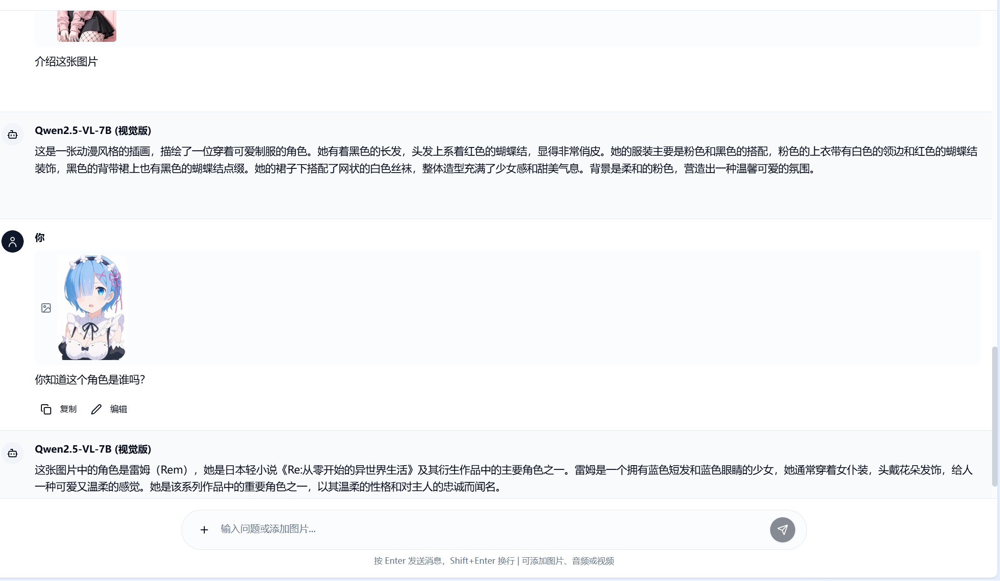

# Herta - AI 对话助手应用

Herta 是一款基于现代前端技术栈构建的 AI 对话助手应用，支持与多种 AI 模型进行交互，提供丰富的格式化展示和便捷的对话管理功能。

注意：由于项目采用纯前端架构（无后端），API Key 存储在客户端，在公开或高安全需求场景下不够安全，因此更适合个人使用或信任的内部场景。

## 应用截图





## 核心功能

- **多模型集成**：支持 OpenAI（GPT-4/3.5）、Claude、Google Gemini、百度文心等主流 AI 模型，同时兼容本地部署模型（如 LM Studio、Ollama）及自定义 API 接口
- **多模态支持**：支持图片、音频、视频上传，与支持多模态的 AI 模型进行交互
- **高级配置**：支持自定义请求体模板、请求头、响应解析路径，完美适配各种 API 格式
- **流式输出**：支持实时流式响应，提供更好的交互体验
- **思维链显示**：智能识别和展示 AI 的思考过程，支持展开/收起
- **Markdown 全支持**：完美渲染 Markdown 内容，包括表格、列表、任务列表等 GFM 特性
- **数学公式渲染**：通过 KaTeX 支持 LaTeX 数学公式（行内公式 `$...$` 和块级公式 `$$...$$`）
- **对话管理**：支持新建、删除、搜索对话，对话状态本地持久化
- **国际化支持**：内置中英文切换，适配不同语言使用场景

## 技术栈

- **核心框架**：React 18 + TypeScript
- **构建工具**：Vite
- **样式解决方案**：Tailwind CSS + Radix UI
- **包管理**：pnpm
- **Markdown 处理**：react-markdown + remark-gfm
- **数学公式**：katex + rehype-katex
- **国际化**：i18next + react-i18next
- **表单处理**：react-hook-form
- **路由管理**：React Router

## 快速开始

### 环境要求

- Node.js 16+
- p npm 8+

### 安装步骤

1. 克隆仓库
   ```bash
   git clone https://github.com/your-username/herta.git
   cd herta
   ```

2. 安装依赖
   ```bash
   pnpm install
   ```

3. 启动开发服务器
   ```bash
   pnpm dev
   ```

4. 访问应用：打开浏览器访问 `http://localhost:5173`

### 构建生产版本

```bash
pnpm build
# 预览生产版本
pnpm preview
```

## 使用指南

### 模型配置

1. 点击右上角设置图标打开模型配置面板
2. 点击"新增"按钮添加模型配置
3. 填写模型信息（名称、类型、API 地址、API 密钥等）
4. 保存配置后，可在模型选择器中切换使用的模型

#### 支持的模型类型

- **OpenAI**：GPT-4、GPT-3.5 等
- **Claude**：Claude-3、Claude-2 等
- **Google Gemini**：Gemini Pro、Gemini Ultra 等
- **百度文心**：文心一言、千帆大模型等
- **本地模型**：Ollama、LM Studio 等
- **自定义 API**：支持任意兼容 OpenAI 格式的 API

#### 高级配置示例

**自定义请求头：**
```json
{
  "Authorization": "{{apiKey}}",
  "Content-Type": "application/json"
}
```

**自定义响应解析：**
- 内容路径：`choices[0].message.content`
- 错误路径：`error.message`
- 使用情况路径：`usage`

### 对话操作

- 点击左侧"新建对话"按钮创建新对话
- 点击对话标题可编辑标题
- 在输入框中输入内容，按 Enter 发送消息（可在设置中切换为 Ctrl+Enter）
- 支持发送 Markdown 格式内容，会自动渲染为富文本
- 自动根据对话的第一条内容生成默认标题

### 代码块使用

- 代码块支持一键复制（hover 代码块时显示复制按钮）
- 支持多种编程语言的语法高亮（通过指定语言标识，如 ```javascript）

### 多模态功能

- **图片支持**：支持拖拽或点击上传图片，自动显示缩略图预览，使用支持音频解析的模型可以分析图像内容
- **音频支持**：支持上传音频文件，使用支持音频解析的模型可以分析音频内容
- **视频支持**：支持上传视频文件，使用支持视频解析的模型可以分析视频内容
- **智能识别**：根据模型能力自动启用/禁用多模态功能

### 高级配置

- **自定义请求体**：支持自定义 API 请求体模板，使用变量替换（`{{modelName}}`、`{{messages}}` 等）
- **自定义请求头**：支持添加自定义请求头，如认证信息
- **响应解析**：支持自定义响应解析路径，适配不同 API 格式
- **流式支持**：自动检测并支持流式响应，提供实时输出体验

### 思维链功能

- **自动识别**：智能识别 AI 的思考过程（`<think>` 标签）
- **实时显示**：流式输出时实时显示思考过程
- **展开收起**：支持展开/收起完整的思考过程
- **时间估算**：根据思考内容长度估算思考时间

### 数学公式

- 行内公式：使用 `$...$` 包裹，如 `$E=mc^2$`
- 块级公式：使用 `$$...$$` 包裹，如：
  ```
  $$
  \sum_{i=1}^n i = \frac{n(n+1)}{2}
  $$
  ```

## 项目结构

```
src/
├── components/       #  UI组件
│   ├── chat/         # 对话相关组件
│   │   ├── ChatInput.tsx      # 输入组件（支持多模态）
│   │   ├── ChatMessage.tsx    # 消息显示组件（支持思维链）
│   │   ├── ChatContent.tsx    # 对话内容组件
│   │   ├── ChatSidebar.tsx    # 侧边栏组件
│   │   ├── MarkdownRenderer.tsx # Markdown渲染组件
│   │   ├── ModelConfigDialog.tsx # 模型配置对话框
│   │   ├── ModelSelector.tsx  # 模型选择器
│   │   └── SettingsDialog.tsx # 设置对话框
│   ├── ui/           # 基础UI组件
│   └── common/       # 通用组件
├── pages/            # 页面组件
├── hooks/            # 自定义Hooks
│   ├── useChat.ts    # 对话逻辑Hook
│   └── useToast.tsx  # 提示Hook
├── services/         # 服务层
│   ├── chatService.ts # 对话服务（支持流式输出）
│   └── ollamaService.ts # Ollama服务
├── utils/            # 工具函数
│   ├── modelStorage.ts  # 模型配置存储
│   ├── settingsStorage.ts # 设置存储
│   ├── modelAdapters.ts # 模型适配器
│   └── responseParsers.ts # 响应解析器
├── types/            # 类型定义
│   ├── chat.ts       # 对话相关类型
│   ├── model.ts      # 模型配置类型
│   └── index.ts      # 类型导出
├── i18n/             # 国际化配置
│   ├── locales/      # 语言文件
│   └── index.ts      # 国际化配置
├── lib/              # 工具库
└── App.tsx           # 应用入口
```


## 许可证

[MIT](LICENSE)