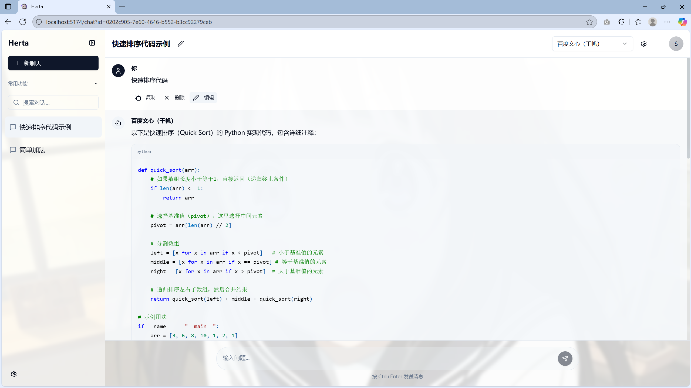

# Herta - AI 对话助手应用

Herta 是一款基于现代前端技术栈构建的 AI 对话助手应用，支持与多种 AI 模型进行交互，提供丰富的格式化展示和便捷的对话管理功能。

## 应用截图




## 核心功能

- **多模型集成**：支持 OpenAI（GPT-4/3.5）、Claude、Google Gemini、百度文心等主流 AI 模型，同时兼容本地部署模型（如 LM Studio、Ollama）及自定义 API 接口
- **Markdown 全支持**：完美渲染 Markdown 内容，包括表格、列表、任务列表等 GFM 特性
- **数学公式渲染**：通过 KaTeX 支持 LaTeX 数学公式（行内公式 `$...$` 和块级公式 `$$...$$`）
- **代码块增强**：代码块支持语法高亮和一键复制功能，提升技术对话体验
- **对话管理**：支持新建、删除、搜索对话，对话状态本地持久化
- **国际化支持**：内置中英文切换，适配不同语言使用场景
- **自定义配置**：可配置模型参数（最大 Token 数、温度值等），满足个性化需求

## 技术栈

- **核心框架**：React 18 + TypeScript
- **构建工具**：Vite
- **样式解决方案**：Tailwind CSS + Radix UI
- **包管理**：pnpm
- **Markdown 处理**：react-markdown + remark-gfm
- **数学公式**：katex + rehype-katex
- **国际化**：i18next + react-i18next
- **表单处理**：react-hook-form
- **路由管理**：React Router

## 快速开始

### 环境要求

- Node.js 16+
- pnpm 8+

### 安装步骤

1. 克隆仓库
   ```bash
   git clone https://github.com/your-username/herta.git
   cd herta
   ```

2. 安装依赖
   ```bash
   pnpm install
   ```

3. 启动开发服务器
   ```bash
   pnpm dev
   ```

4. 访问应用：打开浏览器访问 `http://localhost:5173`

### 构建生产版本

```bash
pnpm build
# 预览生产版本
pnpm preview
```

## 使用指南

### 模型配置

1. 点击右上角设置图标打开模型配置面板
2. 点击"新增"按钮添加模型配置
3. 填写模型信息（名称、类型、API 地址、API 密钥等）
4. 保存配置后，可在模型选择器中切换使用的模型

### 对话操作

- 点击左侧"新建对话"按钮创建新对话
- 点击对话标题可编辑标题
- 在输入框中输入内容，按 Enter 发送消息（可在设置中切换为 Ctrl+Enter）
- 支持发送 Markdown 格式内容，会自动渲染为富文本

### 代码块使用

- 代码块支持一键复制（hover 代码块时显示复制按钮）
- 支持多种编程语言的语法高亮（通过指定语言标识，如 ```javascript）

### 数学公式

- 行内公式：使用 `$...$` 包裹，如 `$E=mc^2$`
- 块级公式：使用 `$$...$$` 包裹，如：
  ```
  $$
  \sum_{i=1}^n i = \frac{n(n+1)}{2}
  $$
  ```

## 项目结构

```
src/
├── components/       #  UI组件
│   ├── chat/         # 对话相关组件
│   ├── ui/           # 基础UI组件
│   └── common/       # 通用组件
├── pages/            # 页面组件
├── utils/            # 工具函数
│   ├── modelStorage.ts  # 模型配置存储
│   └── settingsStorage.ts # 设置存储
├── types/            # 类型定义
├── i18n/             # 国际化配置
├── lib/              # 工具库
└── App.tsx           # 应用入口
```

## 许可证

[MIT](LICENSE)