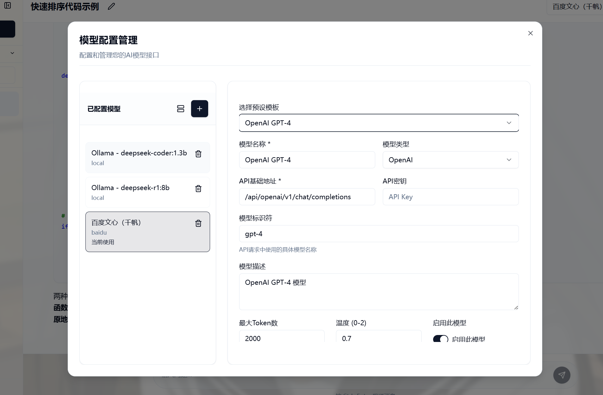

# Herta - AI 对话助手应用

Herta 是一款基于现代前端技术栈构建的 AI 对话助手应用，支持与多种 AI 模型进行交互，提供丰富的格式化展示、便捷的对话管理功能

应用集成了Supabase作为后端服务，支持用户认证、数据云同步和离线模式，确保数据安全和可用性。

## 应用截图





## 核心功能

- **多模型集成**：支持 OpenAI（GPT-4/3.5）、Claude、Google Gemini、百度文心等主流 AI 模型，同时兼容本地部署模型（如 LM Studio、Ollama）及自定义 API 接口
- **多模态支持**：支持图片、音频、视频上传，与支持多模态的 AI 模型进行交互
- **高级配置**：支持自定义请求体模板、请求头、响应解析路径，完美适配各种 API 格式
- **流式输出**：支持实时流式响应，提供更好的交互体验
- **思维链显示**：智能识别和展示 AI 的思考过程，支持展开/收起
- **Markdown 全支持**：完美渲染 Markdown 内容，包括表格、列表、任务列表等 GFM 特性
- **数学公式渲染**：通过 KaTeX 支持 LaTeX 数学公式（行内公式 `$...$` 和块级公式 `$$...$$`）
- **对话管理**：支持新建、删除、搜索对话，对话状态本地持久化
- **用户认证系统**：完整的用户登录、注册和个人资料管理功能
- **数据云同步**：通过Supabase实现对话数据的云端存储和同步

## 技术栈

- **核心框架**：React 18 + TypeScript
- **构建工具**：Vite
- **样式解决方案**：Tailwind CSS + Radix UI
- **包管理**：npm
- **表单处理**：react-hook-form
- **路由管理**：React Router
- **后端服务**：Supabase

## 快速开始

### 环境要求

- Node.js 16+
- p npm 8+

### 安装步骤

1. 克隆仓库
   ```bash
   git clone https://github.com/your-username/herta.git
   cd herta
   ```

2. 安装依赖
   ```bash
   pnpm install
   ```

3. 启动开发服务器
   ```bash
   pnpm dev
   ```

4. 访问应用：打开浏览器访问 `http://localhost:5173`

### 构建生产版本

```bash
pnpm build
# 预览生产版本
pnpm preview
```

## 使用指南

### 环境配置

应用支持Supabase云数据库数据存储方式。可配置Supabase数据库以启用云同步功能。

#### 环境变量配置

1. 复制`.env.example`文件为`.env`：
   ```bash
   cp .env.example .env
   ```

2. 编辑`.env`文件，配置以下环境变量：
   ```env
   # Supabase配置
   VITE_SUPABASE_URL="your-supabase-url"
   VITE_SUPABASE_ANON_KEY="your-supabase-anon-key"
   
   # 数据库连接超时设置（毫秒）
   VITE_SUPABASE_TIMEOUT=30000
   
   # 开发模式设置
   VITE_DEV_MODE=true
   
   # 离线优先模式
   VITE_OFFLINE_FIRST=true
   ```

#### Supabase数据库设置


1. **创建Supabase项目**：
   - 访问 [Supabase官网](https://supabase.com/) 并创建新的项目
   - 获取项目的URL和匿名密钥（在项目设置 -> API 中）

2. **创建数据库表结构**：
   在Supabase SQL编辑器中执行以下SQL语句创建所需表结构：

   ```sql
   -- 创建users表
   CREATE TABLE IF NOT EXISTS users (
     id UUID PRIMARY KEY,
     email VARCHAR(255) UNIQUE,
     name VARCHAR(100),
     avatar_url TEXT,
     created_at TIMESTAMPTZ DEFAULT NOW(),
     updated_at TIMESTAMPTZ DEFAULT NOW()
   );
   
   CREATE INDEX idx_users_email ON users(email);

   -- 创建conversations表
   CREATE TABLE IF NOT EXISTS conversations (
     id UUID PRIMARY KEY,
     user_id UUID REFERENCES users(id) ON DELETE CASCADE,
     title VARCHAR(255) NOT NULL,
     created_at TIMESTAMPTZ NOT NULL,
     updated_at TIMESTAMPTZ NOT NULL,
     sync_version INTEGER DEFAULT 1,
     last_accessed_at TIMESTAMPTZ DEFAULT NOW()
   );
   
   CREATE INDEX idx_conversations_user_id ON conversations(user_id);
   CREATE INDEX idx_conversations_last_accessed ON conversations(last_accessed_at);
   CREATE INDEX idx_conversations_updated_at ON conversations(updated_at DESC);

   -- 创建messages表
   CREATE TABLE IF NOT EXISTS messages (
     id UUID PRIMARY KEY,
     conversation_id UUID REFERENCES conversations(id) ON DELETE CASCADE,
     role VARCHAR(20) NOT NULL CHECK (role IN ('user', 'assistant', 'system')),
     content TEXT NOT NULL,
     timestamp TIMESTAMPTZ NOT NULL,
     model_name VARCHAR(100),
     model_id VARCHAR(100),
     created_at TIMESTAMPTZ DEFAULT NOW(),
     updated_at TIMESTAMPTZ DEFAULT NOW()
   );
   
   CREATE INDEX idx_messages_conversation_id ON messages(conversation_id);
   CREATE INDEX idx_messages_timestamp ON messages(timestamp);

   -- 创建attachments表
   CREATE TABLE IF NOT EXISTS attachments (
     id UUID PRIMARY KEY,
     message_id UUID REFERENCES messages(id) ON DELETE CASCADE,
     type VARCHAR(20) NOT NULL CHECK (type IN ('image', 'audio', 'video')),
     url TEXT NOT NULL,
     file_name VARCHAR(255),
     file_size INTEGER,
     storage_key TEXT,
     created_at TIMESTAMPTZ DEFAULT NOW()
   );
   
   CREATE INDEX idx_attachments_message_id ON attachments(message_id);

   -- 创建model_configs表
   CREATE TABLE IF NOT EXISTS model_configs (
     id UUID PRIMARY KEY,
     user_id UUID REFERENCES users(id) ON DELETE CASCADE,
     name VARCHAR(255) NOT NULL,
     model_type VARCHAR(50) NOT NULL, -- openai, claude, gemini, baidu, local, custom
     api_url TEXT,
     api_key TEXT, -- 存储加密的API密钥
     model_name VARCHAR(255),
     description TEXT,
     max_tokens INTEGER,
     temperature FLOAT,
     enabled BOOLEAN DEFAULT true,
     is_active BOOLEAN DEFAULT false,
     supports_multimodal BOOLEAN DEFAULT false,
     custom_request_config JSONB, -- 存储自定义请求配置
     created_at TIMESTAMPTZ DEFAULT NOW(),
     updated_at TIMESTAMPTZ DEFAULT NOW()
   );
   
   CREATE INDEX idx_model_configs_user_id ON model_configs(user_id);
   CREATE INDEX idx_model_configs_active ON model_configs(user_id, is_active);
   
   -- 确保每个用户只有一个活动模型
   CREATE UNIQUE INDEX idx_model_configs_one_active_per_user
   ON model_configs(user_id)
   WHERE is_active = true;
   ```

3. **配置RLS策略**：
   为确保数据安全，启用并配置行级安全策略：

   ```sql
   -- 启用RLS
   ALTER TABLE users ENABLE ROW LEVEL SECURITY;
   ALTER TABLE conversations ENABLE ROW LEVEL SECURITY;
   ALTER TABLE messages ENABLE ROW LEVEL SECURITY;
   ALTER TABLE attachments ENABLE ROW LEVEL SECURITY;
   ALTER TABLE model_configs ENABLE ROW LEVEL SECURITY;

   -- 配置RLS策略
   -- 允许用户访问自己的数据
   CREATE POLICY "Users can access their own data" ON users
     USING (auth.uid() = id);

   -- 允许用户读取和写入自己的对话
   CREATE POLICY "Users can manage their own conversations" ON conversations
     USING (auth.uid() = user_id)
     WITH CHECK (auth.uid() = user_id);

   -- 允许用户读取和写入自己对话中的消息
   CREATE POLICY "Users can manage messages in their conversations" ON messages
     USING (conversation_id IN (SELECT id FROM conversations WHERE user_id = auth.uid()))
     WITH CHECK (conversation_id IN (SELECT id FROM conversations WHERE user_id = auth.uid()));

   -- 允许用户读取和写入自己消息中的附件
   CREATE POLICY "Users can manage attachments in their messages" ON attachments
     USING (message_id IN (SELECT id FROM messages WHERE conversation_id IN (SELECT id FROM conversations WHERE user_id = auth.uid())))
     WITH CHECK (message_id IN (SELECT id FROM messages WHERE conversation_id IN (SELECT id FROM conversations WHERE user_id = auth.uid())));

   -- 允许用户读取和写入自己的模型配置
   CREATE POLICY "Users can manage their own model configs" ON model_configs
     USING (auth.uid() = user_id)
     WITH CHECK (auth.uid() = user_id);
   ```

4. **设置PostgreSQL函数**：
   为支持数据同步冲突解决，添加以下函数：
   
   ```sql
   -- 更新对话时自动更新updated_at
   CREATE OR REPLACE FUNCTION update_updated_at_column()
   RETURNS TRIGGER AS $$
   BEGIN
       NEW.updated_at = NOW();
       RETURN NEW;
   END;
   $$ language 'plpgsql';
   
   -- 为conversations表添加触发器
   CREATE TRIGGER update_conversations_updated_at 
   BEFORE UPDATE ON conversations 
   FOR EACH ROW EXECUTE FUNCTION update_updated_at_column();
   
   -- 为messages表添加触发器
   CREATE TRIGGER update_messages_updated_at 
   BEFORE UPDATE ON messages 
   FOR EACH ROW EXECUTE FUNCTION update_updated_at_column();
   
   -- 为model_configs表添加触发器
   CREATE TRIGGER update_model_configs_updated_at 
   BEFORE UPDATE ON model_configs 
   FOR EACH ROW EXECUTE FUNCTION update_updated_at_column();
   ```

4. **配置Supabase认证**：
   - 在Supabase控制台中，启用Email认证
   - 设置合适的站点URL

### 数据存储机制

#### API密钥安全存储

应用采用多层次的API密钥安全存储机制，确保用户凭证的安全性：

1. **持久化存储**：
   - 所有API密钥通过Supabase的`model_configs`表加密存储
   - 每个API密钥与特定用户ID（`user_id`）关联，确保用户间数据隔离
   - 数据库层面使用行级安全策略（RLS）限制对个人配置的访问

2. **内存缓存管理**：
   - 使用内存中的`tempApiKeys` Map临时存储解密后的API密钥
   - 页面卸载或用户登出时自动清除内存中的敏感信息
   - 保存或更新配置时同步更新内存缓存

3. **安全措施**：
   - 前端界面显示时隐藏实际API密钥，仅显示存在标记（'has_key'）
   - 通过专用函数`getModelConfigWithApiKey`获取实际API密钥，增强访问控制
   - 所有模型配置操作均要求提供有效的用户ID


### Supabase配置验证

完成配置后，可以通过以下步骤验证：

1. 启动应用：`npm run dev`
2. 注册/登录Supabase账号
3. 检查控制台日志中是否有Supabase连接成功的提示
4. 创建新对话并发送包含不同类型内容（文本、附件）的消息
5. 刷新页面，确认对话和消息已正确保存并可访问

### 模型配置

1. 点击右上角设置图标打开模型配置面板
2. 点击"新增"按钮添加模型配置
3. 填写模型信息（名称、类型、API 地址、API 密钥等）
4. 保存配置后，可在模型选择器中切换使用的模型

#### 支持的模型类型

- **OpenAI**：GPT-4、GPT-3.5 等
- **Claude**：Claude-3、Claude-2 等
- **Google Gemini**：Gemini Pro、Gemini Ultra 等
- **百度千帆**：文心一言、千帆大模型等
- **本地模型**：Ollama、 等
- **自定义 API**：支持任意兼容 OpenAI 格式的 API

### 对话操作

- 点击左侧"新建对话"按钮创建新对话
- 点击对话标题可编辑标题
- 在输入框中输入内容，按 Enter 发送消息（可在设置中切换为 Ctrl+Enter）
- 支持发送 Markdown 格式内容，会自动渲染为富文本
- 自动根据对话的第一条内容生成默认标题

### 多模态功能

- **图片支持**：支持拖拽或点击上传图片，自动显示缩略图预览，使用支持音频解析的模型可以分析图像内容
- **音频支持**：支持上传音频文件，使用支持音频解析的模型可以分析音频内容
- **视频支持**：支持上传视频文件，使用支持视频解析的模型可以分析视频内容
- **智能识别**：根据模型能力自动启用/禁用多模态功能

### 高级配置

- **自定义请求体**：支持自定义 API 请求体模板，使用变量替换（`{{modelName}}`、`{{messages}}` 等）
- **自定义请求头**：支持添加自定义请求头，如认证信息
- **响应解析**：支持自定义响应解析路径，适配不同 API 格式
- **流式支持**：自动检测并支持流式响应，提供实时输出体验

#### 高级配置示例

**自定义请求头：**
```json
{
  "Authorization": "{{apiKey}}",
  "Content-Type": "application/json"
}
```

**自定义响应解析：**
- 内容路径：`choices[0].message.content`
- 错误路径：`error.message`
- 使用情况路径：`usage`


  ```


## 许可证

[MIT](LICENSE)
